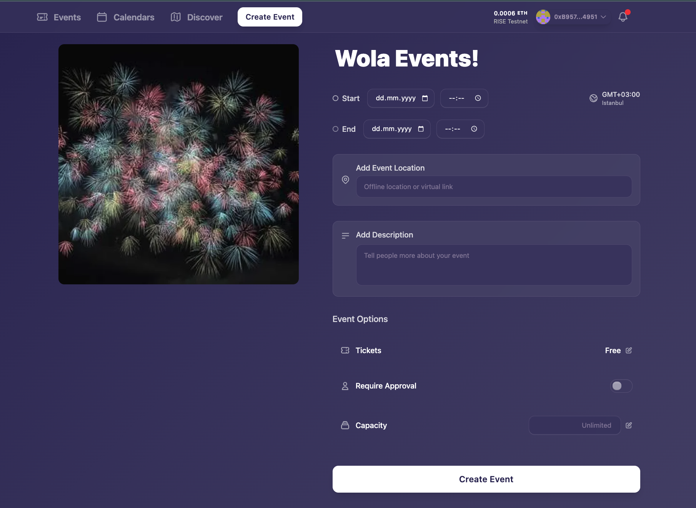
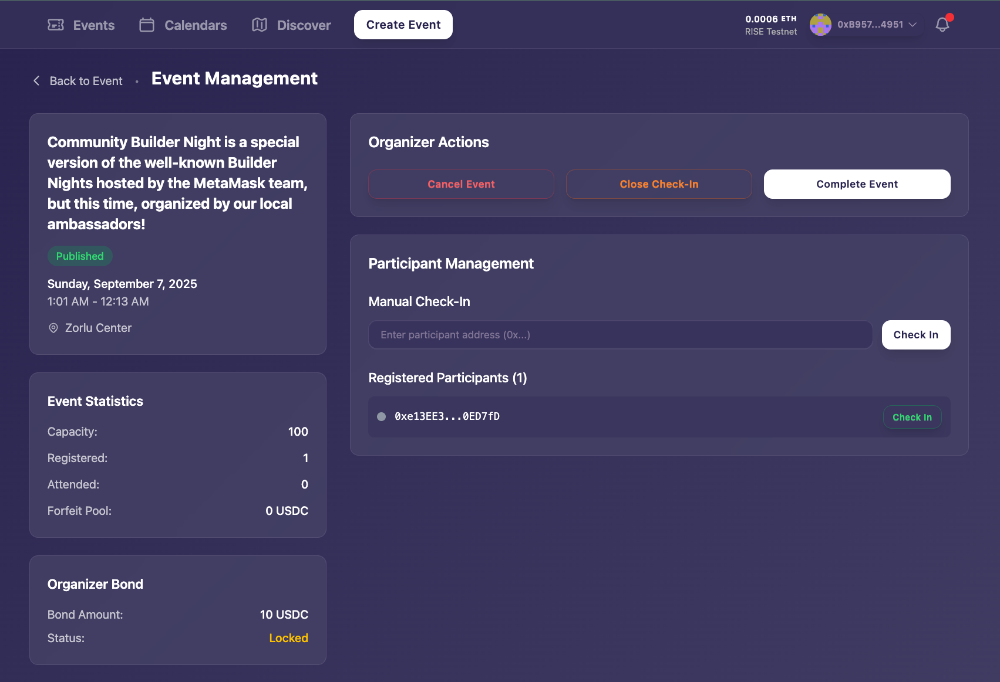
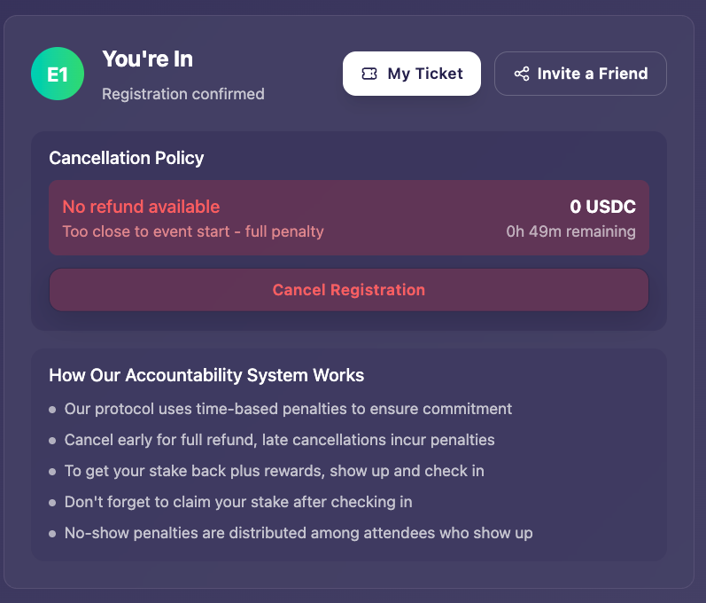
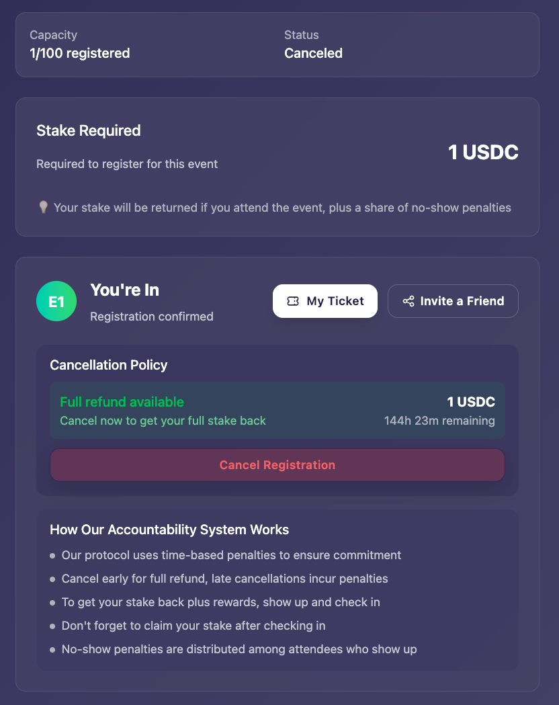

# Wola Events — README

## Getting Started

### Prerequisites
- Node.js ≥ 18 and Yarn
- An RPC endpoint for your target network (e.g., Rise Testnet)
- Deployed **EventManager** contract and an ERC-20 token address (used for deposits/bonds)

### Install & Run
```bash
# install deps
yarn install
# run the app
yarn start
```

## Wallet & Onboarding
The app uses a passkey-based embedded wallet. No extensions. No seed phrases. Users can sign up in seconds with a platform-native passkey and start interacting right away. This keeps onboarding smooth and consistent across devices.

To participate, users must first visit the [register page](https://wola-app-nextjs.vercel.app/register) and register using Rise wallet with their passkey - transaction fees are covered during this process.

**Note on World ID:** Pending implementation due to no Rise bridge.

**Note on POAPs:** Currently unsupported. Custom NFTs available as alternative for tracking event participation.

## About the Application

### What it is
Wola is a decentralized event platform that ensures genuine attendance through financial commitment. Participants put down a deposit when registering for events, which they forfeit if they don't attend these forfeited funds are then shared among actual attendees. Event organizers also stake a bond and must meet minimum attendance thresholds to avoid penalties.

### Why it exists (and how it's different)
- **Skin-in-the-game:** deposits/bonds create real commitment on both sides.
- **Fair redistribution:** no-show penalties reward actual attendees.
- **Trustless & transparent:** funds are held and settled on-chain, and everyone claims directly—no middleman.
- **Proof of humanity(Pending)**: prevents sybil attacks and fake registrations (pending implementation due to World ID not having a Rise bridge yet).

### Core Flow
1. **Create account** (one click with passkey wallet).
2. **Create event** (organizer locks a bond).
3. **Register** (participant locks a deposit; capacity-aware; registration open until start).
4. **Cancel with policy:**
   - Full refund if > `fullRefundHours` before start
   - Partial refund if > `partialRefundHours` (at `partialRefundPercent`%)
   - No refund close to start
5. **Check-in** (organizer marks attendees; non-attendees become no-shows).
6. **Complete event** (anyone after a deadline if organizer doesn't):
   - If attendance ≥ `minAttendanceRatio` (basis points), organizer bond is refunded.
   - Otherwise a proportional penalty is taken from the bond and added to the forfeit pool.
   - Forfeit pool splits by policy: `attendeeSharePercent` to attendees; the rest to organizer.
7. **Claim & Withdraw:**
   - Attendees claim deposit + reward share.
   - Organizer claims bond/refunds.
   - Users withdraw to their wallet anytime.

### Contract (EventManager) highlights
- **Globals:** `attendeeDepositAmount`, `organizerBondAmount`, `minAttendanceRatio` (bps), policy`{ fullRefundHours, partialRefundHours, partialRefundPercent, attendeeSharePercent }`
- **States:** Published → (Canceled | Completed) with check-in and settlement.


## Screenshots / Images

### Event creation page


### Admin event management page


### User registered view — cancellation disabled (period expired)


### Early cancellation — full refund available
